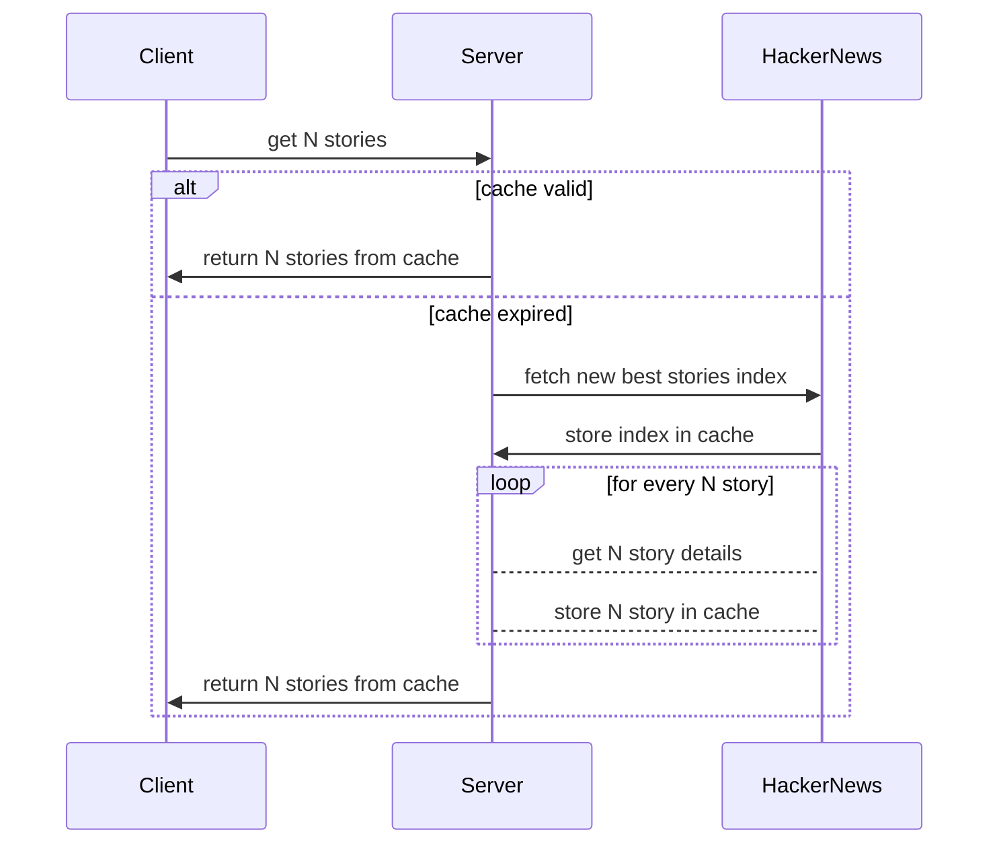

# NetworkStories

## How to run

make sure you have dotnet installed or visit https://dotnet.microsoft.com/en-us/download

to run locally, in repo root:
```
// to start backend webapi
dotnet run --project ./NetworkStories.WebApi/NetworkStories.WebApi.csproj --configuration Release

// to get best N stories
curl -X GET "http://localhost:5259/story?count=10" -H "accept: application/json"
```

## Quality Assurance
* the `application` and `infrastructure` layers are covered by unit tests
* the `webapi` layer is covered by integration tests

## Application Architecure

* highly inspirated by hexagonal/clean architecure,
* introduced meditator/cqrs pattern to achieve loose coupling on `application` and `webapi` layers (this will allow for instance to drop webapi/rest and use messagebus or other solutions without introducing new changes in `application` layer)
* decided to use error pattern (?), to make sure all return variants are covered in compile time, exceptions are try/catched in `infrastructure` layer while interacting with external providers.
* external request are wrapped by retry policy (configurable in .json) and the number of concurrent request is limited by semaphore (configurable in .json) to avoid HackerNews api rate limits.
* also external requests/responses are cached (used `InMemoryStorage`)
* used `FirabaseClient` instad of raw `HttpClient` to reduce LoC

The execution flow in general:


## Todo
Because of limited time box decided to drop:
* validating commands and queries (introduce `FluentValidator` and bind validators with `MediatR`)
* swagger/open-api decorators
* rate limiter for `StoryController`
* docker, integration tests in docker
* use `Redis` insted of `InMemoryStorage`
* more loggers
